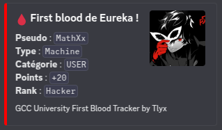

<p align="center">
  
</p>

<h1 align="center">GCC University Tracker</h1>

<p align="center">
  🩸 Discord bot for tracking <strong>first bloods</strong> and <strong>HTB university progress</strong> in real-time.<br>
  Built for ENSIBS' <strong>Galette Cidre CTF (GCC)</strong> team with love.
</p>

<p align="center">
  
  
</p>

---

## Overview

This bot fetches activity from the [Hack The Box](https://hackthebox.com) university program and:

- Detects **first bloods** on challenges, machines, fortresses of your university
- Posts real-time updates into a configured **Discord channel**
- Maintains a TODO list of remaining flag

---

## Features

- 🔁 Discord bot running continuously
- 🛠  HTB API integration to fetch machines/challenges/fortresses of an university
- 🔗 TODO tracker for unsolved content
- 📤 Sends embeds with name, categories, points, avatars
- 🐳 Docker-ready setup

---

## Getting Started

### Prerequisites

- Docker & Docker Compose
- HTB university token
- Discord bot token

### Environment Variables

Create a `.env` file or set the following:

```env
HTB_API_TOKEN=your_htb_token
DISCORD_TOKEN=your_discord_bot_token
DISCORD_CHANNEL_ID=channel_id_for_first_blood
DISCORD_TODO_CHANNEL_ID=channel_id_for_todo
HTB_UNIVERSITY_ID=you_univ_ID
```

### Run with Docker Compose

```bash
docker compose up -d
```

---

## Structure

```
├── main.py                # Main Discord bot logic
├── list_challenge.py      # HTB challenge/machine fetcher
├── db.py                  # Database interactions
├── data/                  # Database sync storage
├── Dockerfile             # Dockerfile of the project
└── docker-compose.yml
```

---

## Example Output

> Discord embed when a first blood is detected:



## Credits

Maintained by [@MTlyx](https://github.com/MTlyx) mainly for **[ENSIBS GCC team](https://app.hackthebox.com/universities/overview/518)**
